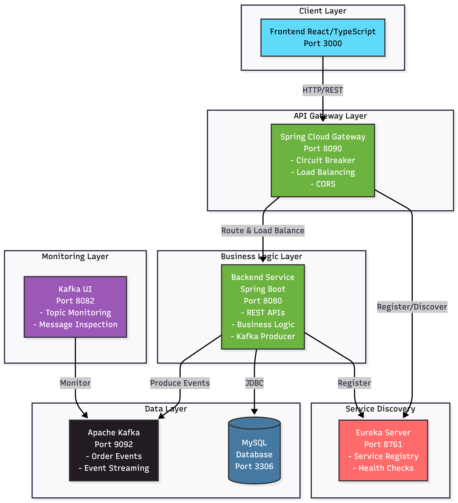
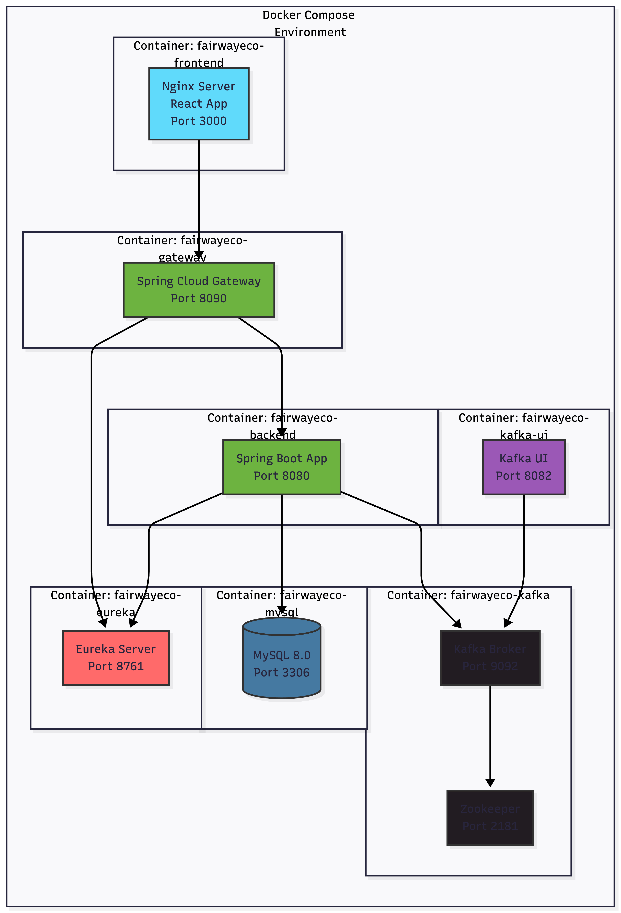
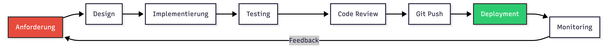
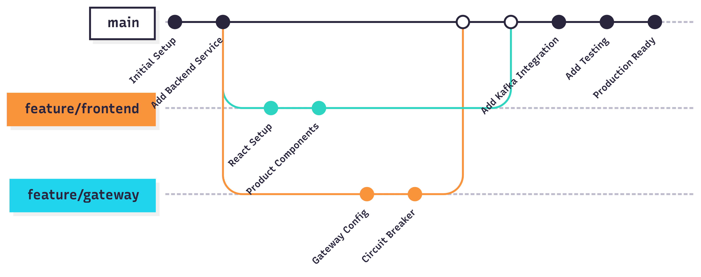
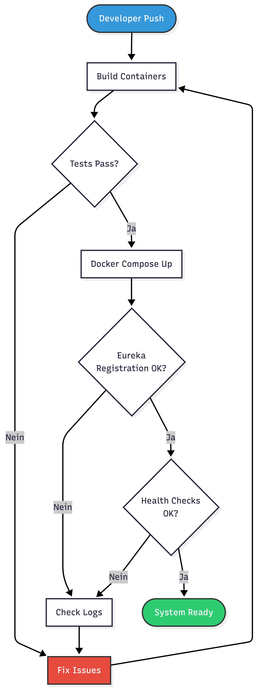
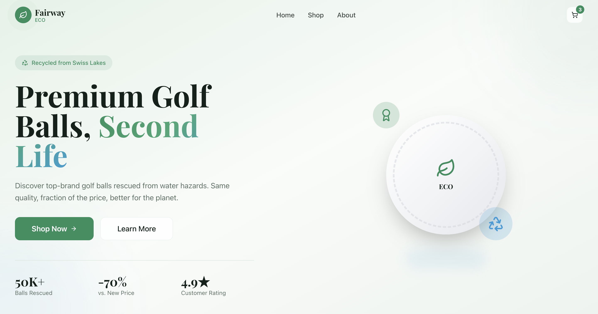
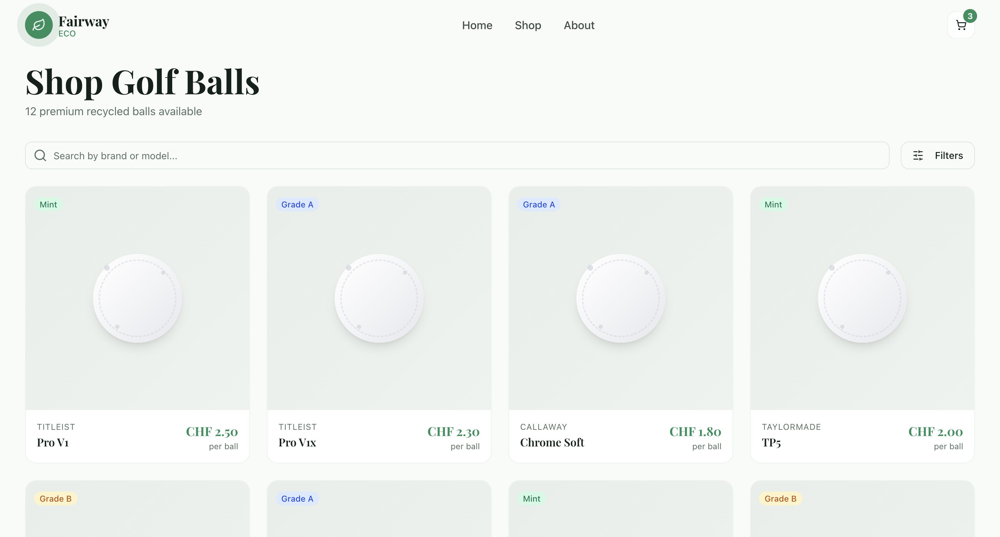
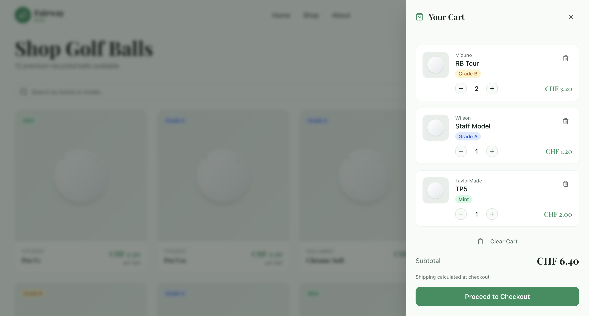

# Projektdefinition & Architektur

## 🎯 Projektidee

**Fairway-Eco** ist eine nachhaltige E-Commerce-Plattform für den Handel mit gebrauchten Golfbällen. Die Plattform ermöglicht es Golfern, gebrauchte Golfbälle in verschiedenen Qualitätsstufen zu kaufen und zu verkaufen, wodurch die Umwelt geschont und Kosten gespart werden.

### Kernfunktionalität

- **Produktkatalog**: Golfbälle verschiedener Marken (Titleist, Callaway, TaylorMade, etc.)
- **Qualitätsstufen**: MINT, NEAR_MINT, GOOD, FAIR - transparent kategorisiert
- **Kundenverwaltung**: Registrierung, Profile, Bestellhistorie
- **Bestellprozess**: Warenkorb, Checkout, Bestellverfolgung
- **Asynchrone Verarbeitung**: Event-basierte Order-Processing

## 🏗️ Architekturskizze

### Gesamtarchitektur

### Request Flow Diagramm

### Deployment-Architektur

## 📋 Workflow im Projekt

### 1. Entwicklungs-Workflow

### 2. Git-Workflow

### 3. Deployment-Workflow

## 🎨 User Interface

Die Benutzeroberfläche bietet:

- Modernes, responsives Design mit TailwindCSS
- Produktkatalog mit Filter- und Suchfunktionen
- Warenkorb mit Real-Time Updates
- Checkout-Prozess mit Formular-Validierung
- Marken-Showcase für Premium-Hersteller

## 🔧 Technologie-Stack

### Frontend

- **React 18**: Moderne Component-basierte UI
- **TypeScript**: Type-Safety für robuste Entwicklung
- **Vite**: Schneller Build-Prozess
- **TailwindCSS**: Utility-First CSS Framework
- **Shadcn/ui**: Hochwertige UI-Komponenten
- **Zustand**: State Management für Shopping Cart

### Backend

- **Spring Boot 3.3.6**: Enterprise Java Framework
- **Spring Data JPA**: Datenbank-Abstraktion
- **Spring Cloud Gateway**: API Gateway mit Resilience
- **Netflix Eureka**: Service Discovery
- **Apache Kafka**: Event Streaming Platform
- **MySQL 8.0**: Relationale Datenbank

### DevOps

- **Docker**: Container-Virtualisierung
- **Docker Compose**: Multi-Container Orchestrierung
- **Maven**: Build-Management für Java
- **npm/bun**: Package Management für Frontend

### Testing & Quality

- **JUnit 5**: Unit Testing Framework
- **Mockito**: Mocking Framework
- **AssertJ**: Fluent Assertions
- **Postman**: API Testing

## 📊 Microservices Übersicht

| Service      | Port | Funktion                 | Technologie            |
| ------------ | ---- | ------------------------ | ---------------------- |
| **Frontend** | 3000 | User Interface           | React + TypeScript     |
| **Gateway**  | 8090 | API Gateway, Routing     | Spring Cloud Gateway   |
| **Eureka**   | 8761 | Service Discovery        | Netflix Eureka         |
| **Backend**  | 8080 | Business Logic, REST API | Spring Boot            |
| **MySQL**    | 3306 | Datenpersistierung       | MySQL 8.0              |
| **Kafka**    | 9092 | Event Streaming          | Apache Kafka           |
| **Kafka UI** | 8082 | Kafka Monitoring         | provectuslabs/kafka-ui |

## 🎯 Architektur-Entscheidungen

### Warum Microservices?

1. **Skalierbarkeit**: Einzelne Services können unabhängig skaliert werden
2. **Wartbarkeit**: Kleinere, fokussierte Codebases
3. **Technologie-Flexibilität**: Verschiedene Tech-Stacks pro Service möglich
4. **Fehler-Isolation**: Probleme in einem Service betreffen nicht das gesamte System

### Warum API Gateway?

1. **Single Entry Point**: Einheitlicher Zugriffspunkt für Clients
2. **Cross-Cutting Concerns**: CORS, Authentication, Rate Limiting zentral
3. **Circuit Breaker**: Fehlertoleranz bei Service-Ausfällen
4. **Load Balancing**: Automatische Lastverteilung

### Warum Kafka?

1. **Asynchrone Verarbeitung**: Entkopplung von Services
2. **Event Sourcing**: Vollständige Event-History
3. **Skalierbarkeit**: Millionen Events pro Sekunde
4. **Reliability**: Garantierte Event-Zustellung

### Warum Eureka?

1. **Service Discovery**: Automatische Service-Registrierung
2. **Health Monitoring**: Automatische Erkennung von Service-Ausfällen
3. **Load Balancing**: Integration mit Spring Cloud LoadBalancer
4. **Zero-Configuration**: Services registrieren sich selbständig

## 📈 Projektziele

### Funktionale Ziele

- ✅ Vollständiger E-Commerce-Workflow implementiert
- ✅ Produktverwaltung mit verschiedenen Qualitätsstufen
- ✅ Kundenverwaltung mit Registrierung
- ✅ Bestellprozess mit Event-basierter Verarbeitung

### Nicht-funktionale Ziele

- ✅ Microservices-Architektur mit klaren Grenzen
- ✅ Hohe Verfügbarkeit durch Circuit Breaker
- ✅ Skalierbarkeit durch Container und Service Discovery
- ✅ Testabdeckung mit 89 Unit Tests
- ✅ API-Dokumentation mit Postman Collections

### Lernziele

- ✅ Praktische Erfahrung mit Microservices
- ✅ Event-Driven Architecture mit Kafka
- ✅ API Gateway Pattern Implementation
- ✅ Container-Orchestrierung mit Docker Compose
- ✅ Moderne Frontend-Entwicklung mit React

---

**Aufgabe 1 erfüllt**: ✅ Architekturskizze erstellt, Projektidee beschrieben, Workflow dokumentiert

_Nächstes Dokument_: [02-Architektur-Details.md](02-Architektur-Details.md) - Technische Vertiefung
