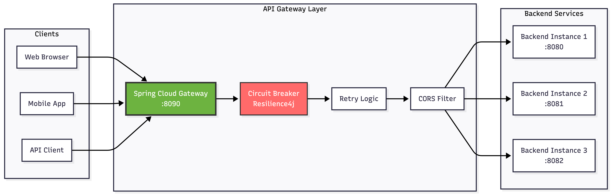
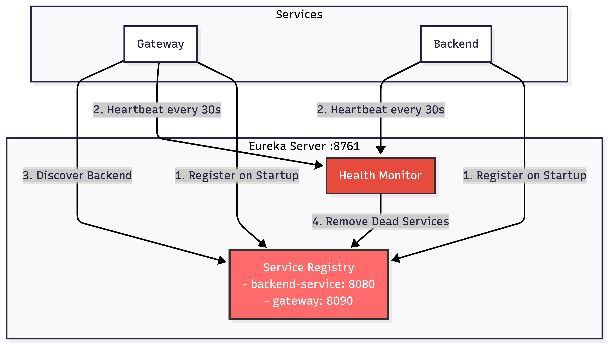
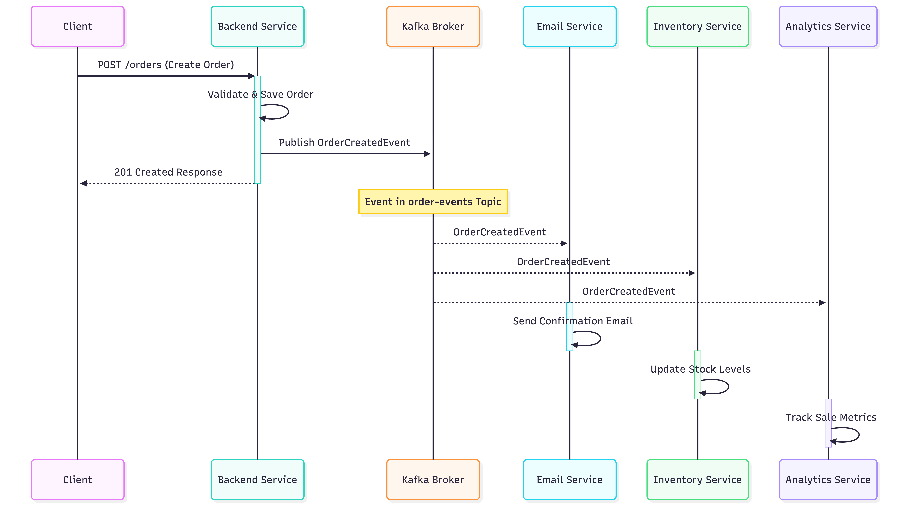
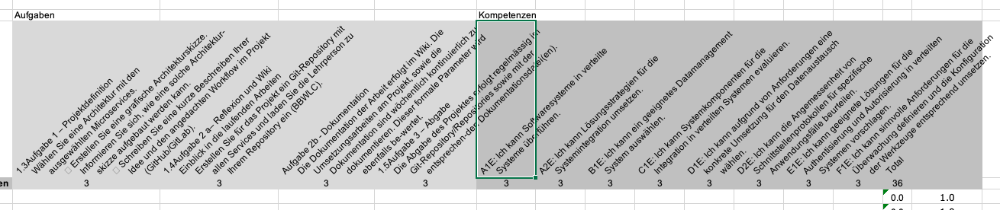
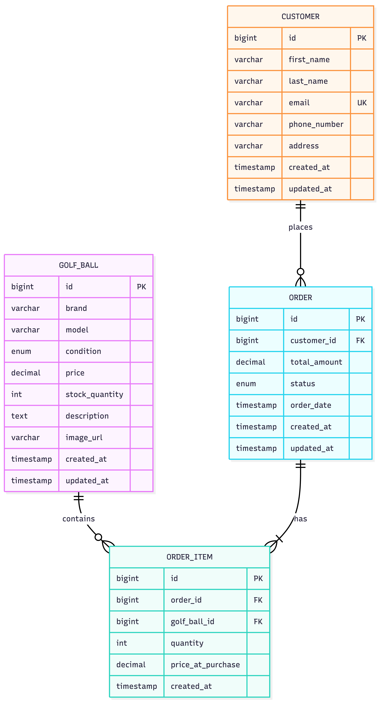
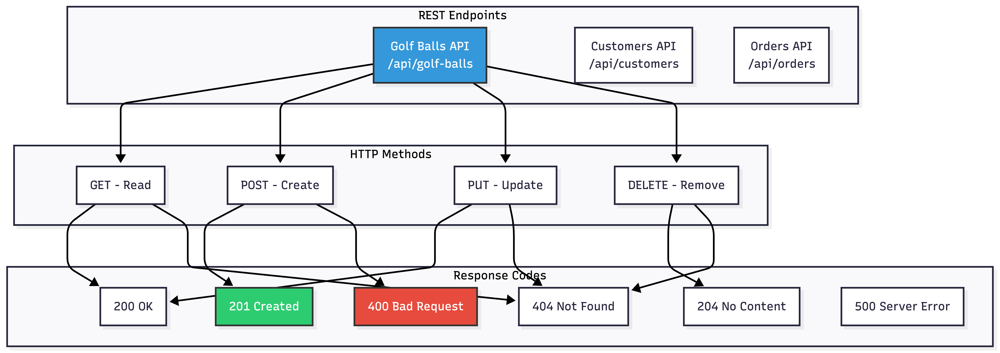
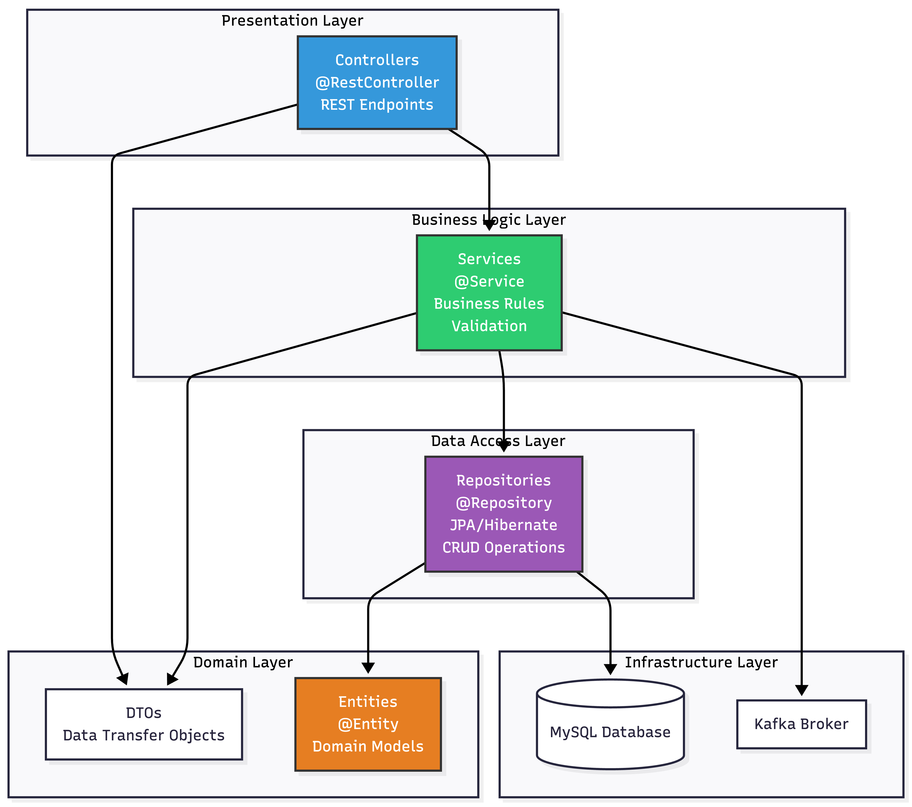
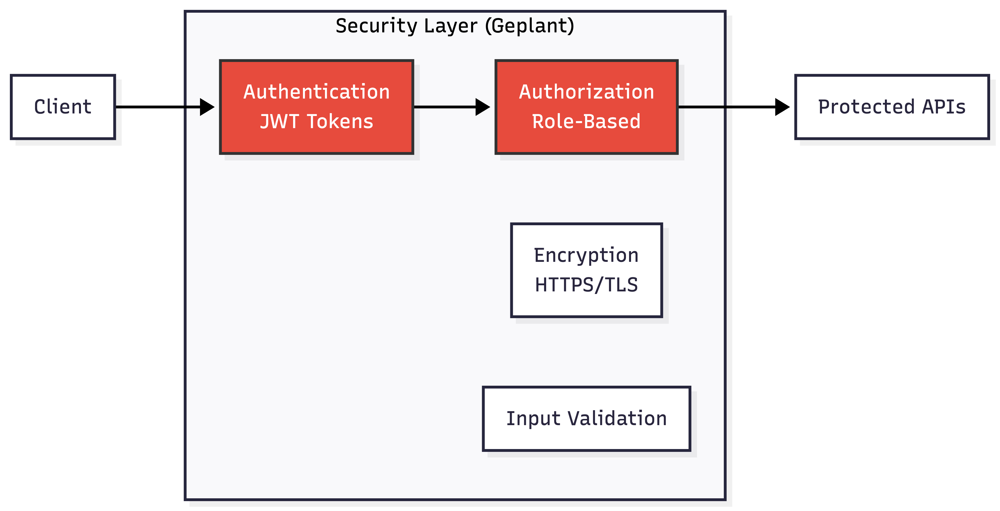
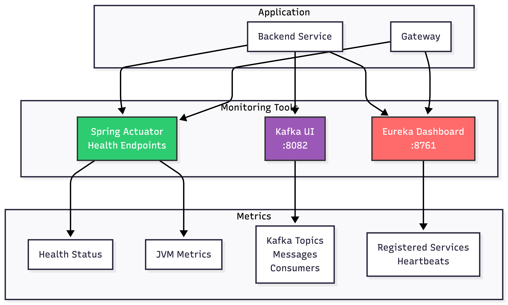

# Architektur-Details

Dieses Dokument beschreibt die technische Implementierung der Fairway-Eco Microservices-Architektur im Detail.

## 📐 Architektur-Patterns

### 1. API Gateway Pattern

Das Gateway ist der zentrale Einstiegspunkt für alle Client-Anfragen.


#### Gateway Konfiguration

**application.yml** (Auszug):

```yaml
spring:
  cloud:
    gateway:
      routes:
        - id: backend-service
          uri: lb://backend-service # Load-balanced durch Eureka
          predicates:
            - Path=/api/**
          filters:
            - RewritePath=/api(?<segment>/?.*), $\{segment}
            - name: CircuitBreaker
              args:
                name: backendCircuitBreaker
                fallbackUri: forward:/fallback
            - name: Retry
              args:
                retries: 3
                statuses: BAD_GATEWAY,SERVICE_UNAVAILABLE
```

**Vorteile**:

- Single Entry Point für alle API-Requests
- Zentrale CORS-Konfiguration
- Circuit Breaker verhindert Cascade-Failures
- Retry-Logik bei temporären Fehlern
- Load Balancing über Eureka

### 2. Service Discovery Pattern

Eureka ermöglicht automatische Service-Registrierung und -Erkennung.


#### Eureka Konfiguration

**Backend Service - bootstrap.yml**:

```yaml
spring:
  application:
    name: backend-service # Service Name in Registry
  cloud:
    discovery:
      enabled: true

eureka:
  client:
    service-url:
      defaultZone: http://eureka-server:8761/eureka/
    register-with-eureka: true
    fetch-registry: true
  instance:
    prefer-ip-address: true
    lease-renewal-interval-in-seconds: 30
```

**Vorteile**:

- Keine hartcodierten Service-URLs
- Automatisches Load Balancing
- Health Monitoring inklusive
- Dynamische Skalierung möglich

### 3. Event-Driven Architecture

Kafka ermöglicht asynchrone, entkoppelte Kommunikation zwischen Services.


#### Kafka Integration

**Backend Service - KafkaProducer**:

```java
@Service
public class OrderEventProducer {

    @Autowired
    private KafkaTemplate<String, OrderEvent> kafkaTemplate;

    private static final String TOPIC = "order-events";

    public void publishOrderCreatedEvent(Order order) {
        OrderEvent event = new OrderEvent(
            order.getId(),
            order.getCustomerId(),
            "ORDER_CREATED",
            LocalDateTime.now()
        );

        kafkaTemplate.send(TOPIC, order.getId().toString(), event);
        log.info("Published OrderCreatedEvent for order {}", order.getId());
    }
}
```

**Vorteile**:

- Services sind entkoppelt (Loose Coupling)
- Asynchrone Verarbeitung (Non-Blocking)
- Event-History verfügbar für Analytics
- Horizontale Skalierbarkeit
- Garantierte Event-Zustellung

### 4. Circuit Breaker Pattern

Resilience4j schützt vor Cascade-Failures.


#### Circuit Breaker Konfiguration

**Gateway - application.yml**:

```yaml
resilience4j:
  circuitbreaker:
    instances:
      backendCircuitBreaker:
        sliding-window-size: 10
        failure-rate-threshold: 50
        wait-duration-in-open-state: 60s
        permitted-number-of-calls-in-half-open-state: 5
        automatic-transition-from-open-to-half-open-enabled: true
```

**Fallback Controller**:

```java
@RestController
public class FallbackController {

    @GetMapping("/fallback")
    public ResponseEntity<ErrorResponse> fallback() {
        return ResponseEntity.status(HttpStatus.SERVICE_UNAVAILABLE)
            .body(new ErrorResponse(
                "Service temporarily unavailable. Please try again later.",
                LocalDateTime.now()
            ));
    }
}
```

**Vorteile**:

- Verhindert Cascade-Failures
- Schnelles Fail für Clients (kein langes Warten)
- Automatische Recovery
- System-Stabilität erhöht

## 🗄️ Datenbank-Schema

### Entity-Relationship Diagramm


### Datenbank-Normalisierung

**Normalformen**:

- ✅ **1NF**: Alle Attribute sind atomar
- ✅ **2NF**: Keine partiellen Abhängigkeiten
- ✅ **3NF**: Keine transitiven Abhängigkeiten

**Indizes für Performance**:

```sql
CREATE INDEX idx_customer_email ON customer(email);
CREATE INDEX idx_order_customer_id ON orders(customer_id);
CREATE INDEX idx_order_status ON orders(status);
CREATE INDEX idx_order_item_order_id ON order_item(order_id);
CREATE INDEX idx_golf_ball_brand ON golf_ball(brand);
CREATE INDEX idx_golf_ball_condition ON golf_ball(condition);
```

## 🔄 API-Architektur

### REST API Design


### API Endpoints Übersicht

#### Golf Balls API

| Method | Endpoint                         | Beschreibung       | Request Body | Response     |
| ------ | -------------------------------- | ------------------ | ------------ | ------------ |
| GET    | `/api/golf-balls`                | Alle Golfbälle     | -            | 200 + List   |
| GET    | `/api/golf-balls/{id}`           | Einzelner Golfball | -            | 200 + Object |
| GET    | `/api/golf-balls/search?brand=X` | Suche nach Marke   | -            | 200 + List   |
| POST   | `/api/golf-balls`                | Neuer Golfball     | GolfBallDto  | 201 + Object |
| PUT    | `/api/golf-balls/{id}`           | Update Golfball    | GolfBallDto  | 200 + Object |
| DELETE | `/api/golf-balls/{id}`           | Lösche Golfball    | -            | 204          |

#### Customers API

| Method | Endpoint                       | Beschreibung     | Request Body | Response     |
| ------ | ------------------------------ | ---------------- | ------------ | ------------ |
| GET    | `/api/customers`               | Alle Kunden      | -            | 200 + List   |
| GET    | `/api/customers/{id}`          | Einzelner Kunde  | -            | 200 + Object |
| GET    | `/api/customers/email/{email}` | Kunde nach Email | -            | 200 + Object |
| POST   | `/api/customers`               | Neuer Kunde      | CustomerDto  | 201 + Object |
| PUT    | `/api/customers/{id}`          | Update Kunde     | CustomerDto  | 200 + Object |
| DELETE | `/api/customers/{id}`          | Lösche Kunde     | -            | 204          |

#### Orders API

| Method | Endpoint                    | Beschreibung              | Request Body | Response     |
| ------ | --------------------------- | ------------------------- | ------------ | ------------ |
| GET    | `/api/orders`               | Alle Bestellungen         | -            | 200 + List   |
| GET    | `/api/orders/{id}`          | Einzelne Bestellung       | -            | 200 + Object |
| GET    | `/api/orders/customer/{id}` | Bestellungen eines Kunden | -            | 200 + List   |
| POST   | `/api/orders`               | Neue Bestellung           | OrderDto     | 201 + Object |
| PATCH  | `/api/orders/{id}/status`   | Update Status             | StatusDto    | 200 + Object |
| DELETE | `/api/orders/{id}`          | Lösche Bestellung         | -            | 204          |

### Request/Response Beispiele

**POST /api/orders - Request**:

```json
{
  "customerId": 1,
  "items": [
    {
      "golfBallId": 5,
      "quantity": 12
    },
    {
      "golfBallId": 8,
      "quantity": 24
    }
  ],
  "totalAmount": 89.88
}
```

**POST /api/orders - Response (201 Created)**:

```json
{
  "id": 42,
  "customerId": 1,
  "items": [
    {
      "id": 101,
      "golfBallId": 5,
      "quantity": 12,
      "priceAtPurchase": 2.99
    },
    {
      "id": 102,
      "golfBallId": 8,
      "quantity": 24,
      "priceAtPurchase": 2.49
    }
  ],
  "totalAmount": 89.88,
  "status": "PENDING",
  "orderDate": "2026-01-17T10:30:00Z"
}
```

## 🏗️ Layered Architecture


### Schichten-Beschreibung

#### 1. Presentation Layer (Controller)

- **Verantwortung**: HTTP Request/Response Handling
- **Technologien**: Spring MVC, @RestController
- **Beispiel**: `GolfBallController`, `OrderController`

#### 2. Business Logic Layer (Service)

- **Verantwortung**: Business Rules, Validierung, Orchestrierung
- **Technologien**: @Service, @Transactional
- **Beispiel**: `GolfBallServiceImpl`, `OrderServiceImpl`

#### 3. Data Access Layer (Repository)

- **Verantwortung**: Datenbank-Operationen
- **Technologien**: Spring Data JPA, Hibernate
- **Beispiel**: `GolfBallRepository`, `OrderRepository`

#### 4. Domain Layer

- **Verantwortung**: Domain Models, DTOs
- **Technologien**: JPA Entities, POJOs
- **Beispiel**: `GolfBall`, `Order`, `GolfBallDto`

## 🔐 Security Konzept

### Geplante Security-Features


**Aktuelle Implementierung**:

- ✅ CORS-Konfiguration im Gateway
- ✅ Input-Validierung mit @Valid
- ⚠️ Authentication/Authorization: Geplant für Production

**Zukünftige Erweiterungen**:

- JWT-basierte Authentication
- Role-Based Access Control (RBAC)
- OAuth2 Integration
- API Rate Limiting

## 📊 Monitoring & Observability


### Health Endpoints

- `GET /actuator/health` - Service Health Status
- `GET /actuator/info` - Application Information
- `GET /actuator/metrics` - JVM & Application Metrics

---

_Nächstes Dokument_: [03-Kompetenznachweise.md](03-Kompetenznachweise.md) - Nachweis aller geforderten Kompetenzen
