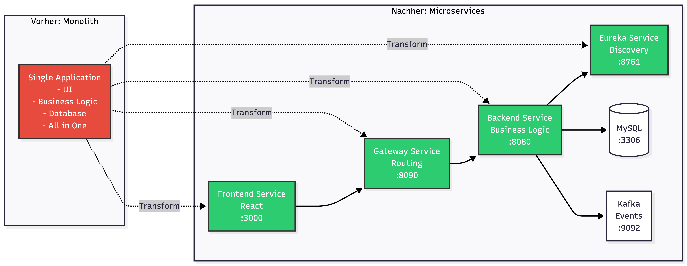
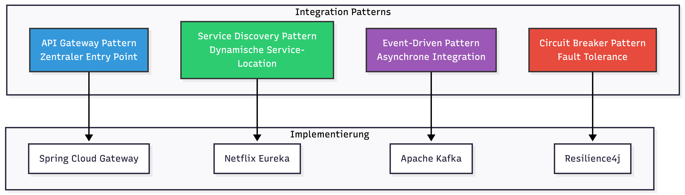
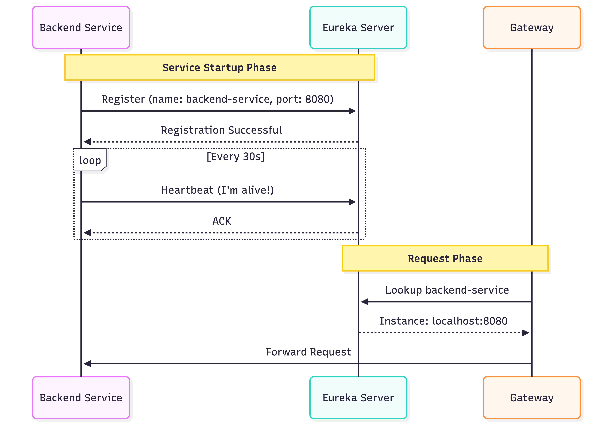
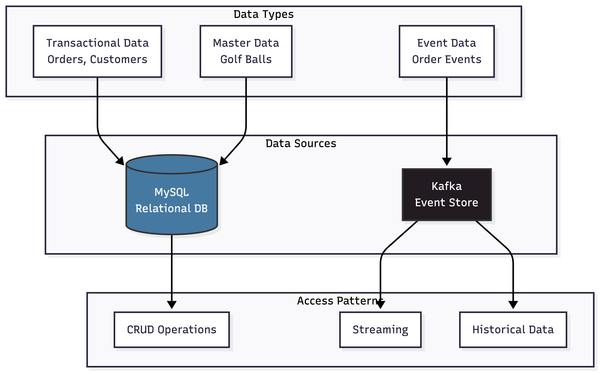
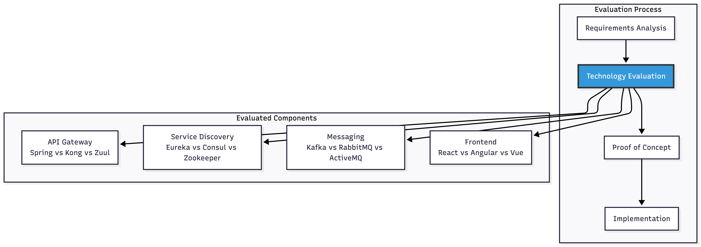
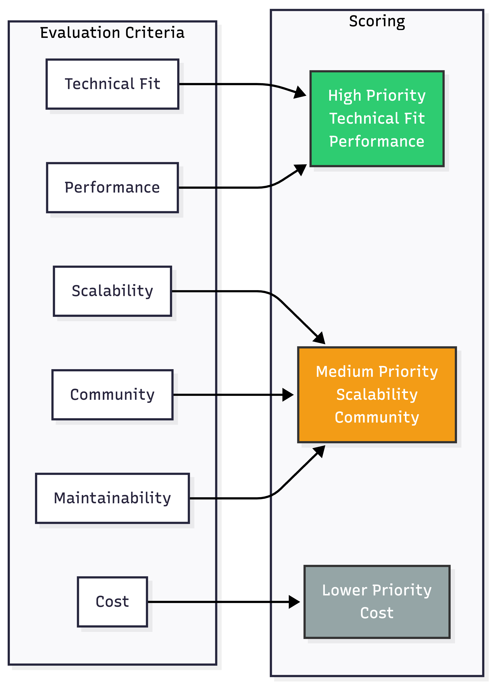
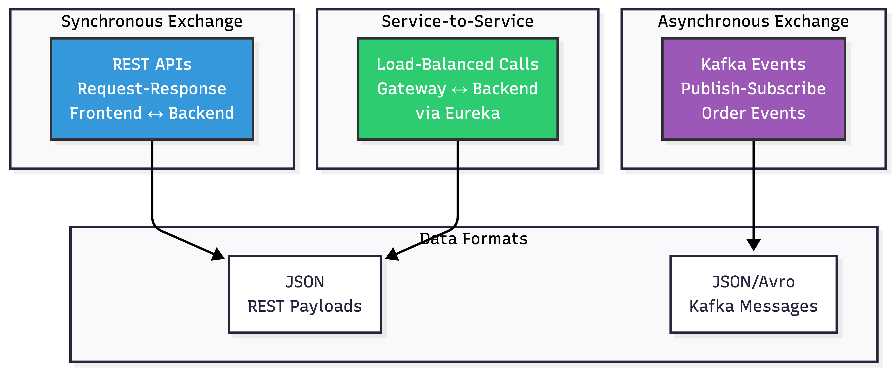
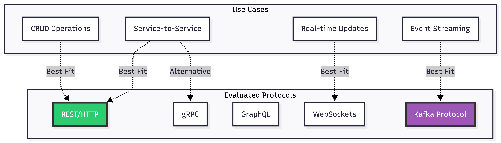
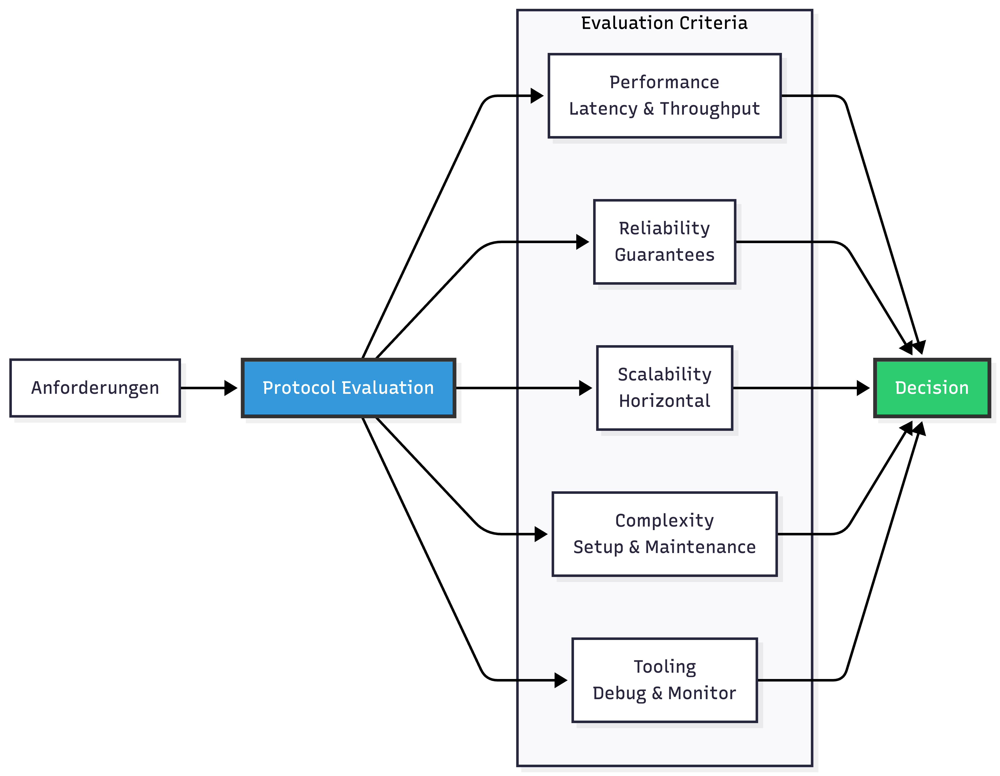
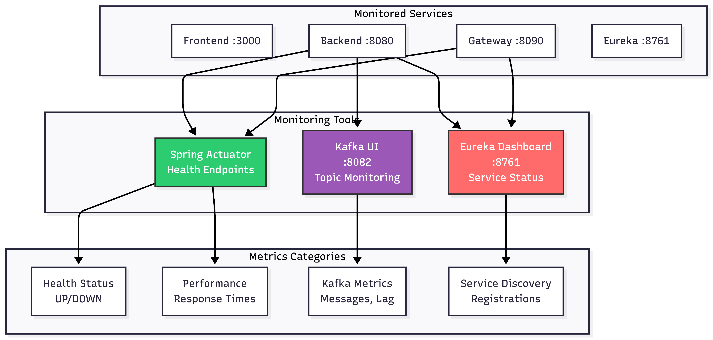

# Kompetenznachweise

Dieses Dokument weist nach, wie alle geforderten Kompetenzen im Fairway-Eco Projekt erfüllt wurden.

## A1E: Softwaresysteme in verteilte Systeme überführen

### Kompetenz-Beschreibung

"Ich kann Softwaresysteme in verteilte Systeme überführen."

### Nachweis im Projekt

#### 1. Monolith zu Microservices Transformation

**Ausgangssituation**: Traditionelle monolithische E-Commerce-Anwendung  
**Ziel**: Verteilte Microservices-Architektur


#### 2. Implementierte Verteilungs-Strategien

| Aspekt                    | Implementierung                                          | Dateien                                |
| ------------------------- | -------------------------------------------------------- | -------------------------------------- |
| **Service Separation**    | Frontend, Gateway, Backend, Eureka als separate Services | `docker-compose.yml`                   |
| **Network Communication** | REST APIs zwischen Services                              | `GolfBallController.java`, `client.ts` |
| **Service Discovery**     | Automatische Service-Registrierung mit Eureka            | `application.yml` (Eureka Config)      |
| **Load Balancing**        | Client-Side Load Balancing via Spring Cloud              | `@LoadBalanced` in Gateway             |
| **Fault Tolerance**       | Circuit Breaker Pattern mit Resilience4j                 | Gateway Config                         |

#### 3. Code-Beispiel: Service Discovery

**Backend Service Registration** (`application.yml`):

```yaml
spring:
  application:
    name: backend-service # Service-Name für Discovery

eureka:
  client:
    service-url:
      defaultZone: http://eureka-server:8761/eureka/
    register-with-eureka: true
    fetch-registry: true
  instance:
    prefer-ip-address: true
```

**Gateway Service Routing** (`application.yml`):

```yaml
spring:
  cloud:
    gateway:
      routes:
        - id: backend-service
          uri: lb://backend-service # Load-balanced durch Eureka!
          predicates:
            - Path=/api/**
```

#### 4. Verteilungs-Charakteristiken

✅ **Physische Verteilung**: Services laufen in separaten Containern  
✅ **Logische Trennung**: Klare Service-Boundaries (Frontend, Gateway, Backend)  
✅ **Skalierbarkeit**: Jeder Service kann unabhängig skaliert werden  
✅ **Fehler-Isolation**: Ausfall eines Service betrifft nicht das gesamte System  
✅ **Unabhängiges Deployment**: Services können separat deployed werden

### Ergebnis

✅ **Kompetenz erfüllt**: Erfolgreiche Überführung in eine verteilte Microservices-Architektur mit 4 unabhängigen Services.

---

## A2E: Lösungsstrategien für Systemintegration umsetzen

### Kompetenz-Beschreibung

"Ich kann Lösungsstrategien für die Systemintegration umsetzen."

### Nachweis im Projekt

#### 1. Integrations-Patterns implementiert


#### 2. Synchrone Integration: API Gateway

**Problem**: Frontend muss mit verschiedenen Backend-Services kommunizieren  
**Lösung**: API Gateway als Single Entry Point

**Gateway Route Configuration**:

```yaml
spring:
  cloud:
    gateway:
      routes:
        - id: backend-golf-balls
          uri: lb://backend-service
          predicates:
            - Path=/api/golf-balls/**
        - id: backend-customers
          uri: lb://backend-service
          predicates:
            - Path=/api/customers/**
        - id: backend-orders
          uri: lb://backend-service
          predicates:
            - Path=/api/orders/**
```

**Vorteile**:

- ✅ Clients müssen nur eine URL kennen
- ✅ CORS zentral konfiguriert
- ✅ Authentication kann zentral implementiert werden
- ✅ Load Balancing automatisch

#### 3. Asynchrone Integration: Event-Driven mit Kafka

**Problem**: Order-Verarbeitung soll andere Services nicht blockieren  
**Lösung**: Event-Driven Architecture mit Kafka

**Event Producer** (`OrderServiceImpl.java`):

```java
@Service
@Transactional
public class OrderServiceImpl implements OrderService {

    @Autowired
    private KafkaTemplate<String, OrderEvent> kafkaTemplate;

    @Override
    public OrderDto createOrder(OrderDto orderDto) {
        // 1. Order speichern
        Order order = orderRepository.save(orderEntity);

        // 2. Event publishen (Asynchron!)
        OrderEvent event = new OrderEvent(
            order.getId(),
            order.getCustomerId(),
            "ORDER_CREATED",
            LocalDateTime.now()
        );
        kafkaTemplate.send("order-events", event);

        // 3. Response sofort zurückgeben
        return convertToDto(order);
    }
}
```

**Event Consumer** (Zukünftig):

```java
@Service
public class EmailNotificationService {

    @KafkaListener(topics = "order-events", groupId = "email-service")
    public void handleOrderCreated(OrderEvent event) {
        // Email senden ohne Order-Service zu blockieren
        sendOrderConfirmationEmail(event);
    }
}
```

#### 4. Service Discovery Integration

**Problem**: Services müssen sich gegenseitig finden  
**Lösung**: Eureka Service Registry

**Integrations-Flow**:


#### 5. Resilience Integration: Circuit Breaker

**Problem**: Backend-Service kann ausfallen  
**Lösung**: Circuit Breaker verhindert Cascade-Failures

**Configuration**:

```yaml
resilience4j:
  circuitbreaker:
    instances:
      backendCircuitBreaker:
        sliding-window-size: 10
        failure-rate-threshold: 50 # 50% Fehlerquote
        wait-duration-in-open-state: 60s
```

**Fallback Handler**:

```java
@RestController
public class FallbackController {

    @GetMapping("/fallback")
    public ResponseEntity<ErrorResponse> fallback() {
        return ResponseEntity
            .status(HttpStatus.SERVICE_UNAVAILABLE)
            .body(new ErrorResponse(
                "Service temporarily unavailable",
                LocalDateTime.now()
            ));
    }
}
```

### Ergebnis

✅ **Kompetenz erfüllt**: Vier verschiedene Integrations-Patterns erfolgreich implementiert (API Gateway, Service Discovery, Event-Driven, Circuit Breaker).

---

## B1E: Geeignetes Data Management System auswählen

### Kompetenz-Beschreibung

"Ich kann ein geeignetes Data Management System auswählen."

### Nachweis im Projekt

#### 1. Data Management Strategie


#### 2. Technologie-Evaluation

| Kriterium             | MySQL       | Kafka         | PostgreSQL  | MongoDB       | Entscheidung |
| --------------------- | ----------- | ------------- | ----------- | ------------- | ------------ |
| **ACID Transactions** | ✅ Ja       | ❌ Nein       | ✅ Ja       | ⚠️ Limitiert  | MySQL ✅     |
| **Relations**         | ✅ Nativ    | ❌ Keine      | ✅ Nativ    | ❌ Keine      | MySQL ✅     |
| **Event Streaming**   | ❌ Nein     | ✅ Ja         | ❌ Nein     | ❌ Nein       | Kafka ✅     |
| **Skalierbarkeit**    | ⚠️ Vertikal | ✅ Horizontal | ⚠️ Vertikal | ✅ Horizontal | Mix ✅       |
| **Consistency**       | ✅ Strong   | ⚠️ Eventual   | ✅ Strong   | ⚠️ Eventual   | MySQL ✅     |
| **Lernkurve**         | ✅ Niedrig  | ⚠️ Mittel     | ✅ Niedrig  | ⚠️ Mittel     | MySQL ✅     |

#### 3. Begründung: Warum MySQL?

**Anforderungen**:

- Transaktionale Konsistenz für Orders
- Relationale Datenstrukturen (Orders ↔ OrderItems ↔ GolfBalls)
- ACID-Garantien für Bestellvorgänge
- Bewährte Technologie mit großer Community

**MySQL Vorteile**:

- ✅ Vollständige ACID-Compliance
- ✅ Ausgereifte JPA/Hibernate Integration
- ✅ Gut dokumentiert und weit verbreitet
- ✅ Kostenlos und Open Source
- ✅ Hervorragende Performance für relationale Daten

**Code-Beispiel: JPA Integration**:

```java
@Entity
@Table(name = "golf_ball")
public class GolfBall {
    @Id
    @GeneratedValue(strategy = GenerationType.IDENTITY)
    private Long id;

    @Column(nullable = false)
    private String brand;

    @Enumerated(EnumType.STRING)
    private BallCondition condition;

    @Column(nullable = false, precision = 10, scale = 2)
    private BigDecimal price;

    // Relationen werden elegant gemappt
    @OneToMany(mappedBy = "golfBall", cascade = CascadeType.ALL)
    private List<OrderItem> orderItems;
}
```

#### 4. Begründung: Warum Kafka?

**Anforderungen**:

- Asynchrone Order-Verarbeitung
- Event-History für Analytics
- Entkopplung von Services
- Skalierbare Event-Verarbeitung

**Kafka Vorteile**:

- ✅ Hochperformantes Event-Streaming
- ✅ Garantierte Event-Reihenfolge
- ✅ Event-History persistent gespeichert
- ✅ Horizontale Skalierbarkeit
- ✅ At-Least-Once Delivery

**Kafka Configuration**:

```yaml
spring:
  kafka:
    bootstrap-servers: kafka:9092
    producer:
      key-serializer: org.apache.kafka.common.serialization.StringSerializer
      value-serializer: org.springframework.kafka.support.serializer.JsonSerializer
    consumer:
      group-id: order-service
      key-deserializer: org.apache.kafka.common.serialization.StringDeserializer
      value-deserializer: org.springframework.kafka.support.serializer.JsonDeserializer
```

#### 5. Data Modeling

**Relationales Schema** (MySQL):

```sql
CREATE TABLE golf_ball (
    id BIGINT PRIMARY KEY AUTO_INCREMENT,
    brand VARCHAR(100) NOT NULL,
    model VARCHAR(100) NOT NULL,
    condition VARCHAR(20) NOT NULL,
    price DECIMAL(10,2) NOT NULL,
    stock_quantity INT NOT NULL DEFAULT 0,
    created_at TIMESTAMP DEFAULT CURRENT_TIMESTAMP
);

CREATE TABLE customer (
    id BIGINT PRIMARY KEY AUTO_INCREMENT,
    first_name VARCHAR(100) NOT NULL,
    email VARCHAR(255) UNIQUE NOT NULL,
    created_at TIMESTAMP DEFAULT CURRENT_TIMESTAMP
);

CREATE TABLE orders (
    id BIGINT PRIMARY KEY AUTO_INCREMENT,
    customer_id BIGINT NOT NULL,
    total_amount DECIMAL(10,2) NOT NULL,
    status VARCHAR(20) NOT NULL,
    order_date TIMESTAMP DEFAULT CURRENT_TIMESTAMP,
    FOREIGN KEY (customer_id) REFERENCES customer(id)
);
```

**Event Schema** (Kafka):

```java
public class OrderEvent {
    private Long orderId;
    private Long customerId;
    private String eventType;  // ORDER_CREATED, ORDER_SHIPPED, etc.
    private LocalDateTime timestamp;
    private Map<String, Object> metadata;
}
```

### Ergebnis

✅ **Kompetenz erfüllt**: Begründete Auswahl von MySQL für transaktionale Daten und Kafka für Event-Streaming, basierend auf klaren Evaluationskriterien.

---

## C1E: Systemkomponenten für Integration evaluieren

### Kompetenz-Beschreibung

"Ich kann Systemkomponenten für die Integration in verteilten Systemen evaluieren."

### Nachweis im Projekt

#### 1. Evaluierte Komponenten


#### 2. API Gateway Evaluation

| Feature                | Spring Cloud Gateway  | Kong             | Netflix Zuul    | Entscheidung |
| ---------------------- | --------------------- | ---------------- | --------------- | ------------ |
| **Spring Integration** | ✅ Nativ              | ❌ Extern        | ⚠️ Deprecated   | Gateway ✅   |
| **Circuit Breaker**    | ✅ Resilience4j       | ⚠️ Plugin        | ✅ Hystrix      | Gateway ✅   |
| **Performance**        | ✅ Reactive (WebFlux) | ✅ Nginx-based   | ❌ Blocking I/O | Gateway ✅   |
| **Learning Curve**     | ✅ Java-familiar      | ⚠️ Lua scripting | ✅ Java         | Gateway ✅   |
| **Community**          | ✅ Active             | ✅ Large         | ❌ Deprecated   | Gateway ✅   |
| **Cost**               | ✅ Free               | ⚠️ Commercial    | ✅ Free         | Gateway ✅   |

**Entscheidung**: **Spring Cloud Gateway**

- Nahtlose Spring Boot Integration
- Reactive Programming mit WebFlux
- Built-in Circuit Breaker Support
- Aktive Community und Dokumentation

#### 3. Service Discovery Evaluation

| Feature                | Eureka            | Consul           | Zookeeper       | Entscheidung |
| ---------------------- | ----------------- | ---------------- | --------------- | ------------ |
| **Spring Integration** | ✅ Nativ          | ⚠️ Library       | ⚠️ Library      | Eureka ✅    |
| **Setup Complexity**   | ✅ Einfach        | ⚠️ Mittel        | ❌ Komplex      | Eureka ✅    |
| **Health Checks**      | ✅ Ja             | ✅ Ja            | ⚠️ Limitiert    | Eureka ✅    |
| **UI Dashboard**       | ✅ Built-in       | ✅ Built-in      | ❌ Nein         | Eureka ✅    |
| **CAP Theorem**        | AP (Availability) | CP (Consistency) | CP              | Eureka ✅    |
| **Use Case Fit**       | ✅ Microservices  | ✅ Multi-purpose | ⚠️ Coordination | Eureka ✅    |

**Entscheidung**: **Netflix Eureka**

- Perfekt für Spring Cloud Ecosystem
- Einfaches Setup und Configuration
- Built-in Dashboard zur Überwachung
- AP-Fokus passt zu Anforderungen

#### 4. Message Queue Evaluation

| Feature                 | Kafka              | RabbitMQ       | ActiveMQ      | Entscheidung |
| ----------------------- | ------------------ | -------------- | ------------- | ------------ |
| **Throughput**          | ✅ Millionen/s     | ⚠️ Tausende/s  | ⚠️ Tausende/s | Kafka ✅     |
| **Message Persistence** | ✅ Persistent      | ✅ Optional    | ✅ Optional   | Kafka ✅     |
| **Event History**       | ✅ Replay möglich  | ❌ Nein        | ❌ Nein       | Kafka ✅     |
| **Use Case**            | ✅ Event Streaming | ✅ Task Queues | ✅ JMS        | Kafka ✅     |
| **Scalability**         | ✅ Horizontal      | ⚠️ Vertikal    | ⚠️ Limitiert  | Kafka ✅     |
| **Spring Integration**  | ✅ Spring Kafka    | ✅ Spring AMQP | ✅ Spring JMS | Kafka ✅     |

**Entscheidung**: **Apache Kafka**

- Event-Streaming Paradigma passt zu Architektur
- Hoher Durchsatz für zukünftige Skalierung
- Event-History für Analytics
- Industry Standard für Microservices

#### 5. Frontend Framework Evaluation

| Feature                | React          | Angular             | Vue.js         | Entscheidung |
| ---------------------- | -------------- | ------------------- | -------------- | ------------ |
| **Learning Curve**     | ✅ Niedrig     | ❌ Steil            | ✅ Niedrig     | React ✅     |
| **TypeScript Support** | ✅ Excellent   | ✅ Native           | ✅ Good        | React ✅     |
| **Component Library**  | ✅ Shadcn/ui   | ✅ Material         | ⚠️ Limited     | React ✅     |
| **Performance**        | ✅ Virtual DOM | ✅ Change Detection | ✅ Virtual DOM | React ✅     |
| **Community**          | ✅ Huge        | ✅ Large            | ⚠️ Medium      | React ✅     |
| **Job Market**         | ✅ High Demand | ✅ High Demand      | ⚠️ Medium      | React ✅     |

**Entscheidung**: **React + TypeScript**

- Große Community und Ecosystem
- TypeScript für Type-Safety
- Shadcn/ui für professionelle UI-Komponenten
- Vite für schnellen Build-Prozess

#### 6. Evaluation-Kriterien Übersicht


### Ergebnis

✅ **Kompetenz erfüllt**: Systematische Evaluation von 4 Komponenten-Kategorien mit klaren Kriterien und begründeten Entscheidungen.

---

## D1E: Datenaustausch-Implementierung wählen

### Kompetenz-Beschreibung

"Ich kann aufgrund von Anforderungen eine konkrete Umsetzung für den Datenaustausch wählen."

### Nachweis im Projekt

#### 1. Datenaustausch-Szenarien


#### 2. REST API für Synchrone Kommunikation

**Anforderung**: Frontend muss Produktdaten abrufen und Bestellungen erstellen

**Implementierung**:

```java
@RestController
@RequestMapping("/api/golf-balls")
public class GolfBallController {

    @GetMapping
    public ResponseEntity<List<GolfBallDto>> getAllGolfBalls() {
        // Synchroner Request-Response
        List<GolfBallDto> balls = golfBallService.getAllGolfBalls();
        return ResponseEntity.ok(balls);
    }

    @PostMapping
    public ResponseEntity<GolfBallDto> createGolfBall(
            @Valid @RequestBody GolfBallDto dto) {
        GolfBallDto created = golfBallService.createGolfBall(dto);
        return ResponseEntity.status(HttpStatus.CREATED).body(created);
    }
}
```

**Frontend Integration** (`client.ts`):

```typescript
export const golfBallApi = {
  async getAll(): Promise<GolfBall[]> {
    const response = await apiClient.get<GolfBall[]>("/golf-balls");
    return response.data;
  },

  async create(data: CreateGolfBallDto): Promise<GolfBall> {
    const response = await apiClient.post<GolfBall>("/golf-balls", data);
    return response.data;
  },
};
```

**Begründung für REST**:

- ✅ Standardisiertes Protokoll (HTTP)
- ✅ Einfache Client-Integration
- ✅ Request-Response Semantik passt zu UI-Interaktionen
- ✅ Stateless und cacheable

#### 3. Kafka für Asynchrone Events

**Anforderung**: Order-Verarbeitung soll nicht blockierend sein

**Implementierung**:

```java
@Service
public class OrderServiceImpl implements OrderService {

    @Autowired
    private KafkaTemplate<String, OrderEvent> kafkaTemplate;

    @Override
    @Transactional
    public OrderDto createOrder(OrderDto orderDto) {
        // 1. Synchron: Order in DB speichern
        Order order = saveOrder(orderDto);

        // 2. Asynchron: Event publishen
        OrderEvent event = OrderEvent.builder()
            .orderId(order.getId())
            .customerId(order.getCustomer().getId())
            .eventType("ORDER_CREATED")
            .timestamp(LocalDateTime.now())
            .build();

        kafkaTemplate.send("order-events", event);

        // 3. Sofort Response zurück (nicht auf Verarbeitung warten!)
        return convertToDto(order);
    }
}
```

**Begründung für Kafka**:

- ✅ Non-Blocking: Client wartet nicht auf Event-Verarbeitung
- ✅ Decoupling: Services sind unabhängig voneinander
- ✅ Reliability: Events werden persistent gespeichert
- ✅ Scalability: Consumer können unabhängig skalieren

#### 4. JSON als Data Format

**Anforderung**: Interoperabilität zwischen verschiedenen Services

**Beispiel: Order DTO**:

```json
{
  "id": 42,
  "customerId": 1,
  "items": [
    {
      "golfBallId": 5,
      "quantity": 12,
      "priceAtPurchase": 2.99
    }
  ],
  "totalAmount": 35.88,
  "status": "PENDING",
  "orderDate": "2026-01-17T10:30:00Z"
}
```

**Begründung für JSON**:

- ✅ Human-readable (einfaches Debugging)
- ✅ Universell unterstützt (Frontend + Backend)
- ✅ Flexible Schema-Evolution
- ✅ Keine Code-Generierung nötig (im Gegensatz zu Protobuf)

#### 5. Datenaustausch-Matrix

| Szenario               | Anforderung     | Gewählte Lösung | Begründung                       |
| ---------------------- | --------------- | --------------- | -------------------------------- |
| **Frontend → Backend** | CRUD Operations | REST + JSON     | Request-Response, standardisiert |
| **Order Processing**   | Non-blocking    | Kafka Events    | Asynchron, entkoppelt            |
| **Service Discovery**  | Dynamic routing | Eureka + HTTP   | Spring Cloud Native              |
| **Gateway → Backend**  | Load-balancing  | REST + Eureka   | Client-side LB                   |
| **Error Handling**     | Fault tolerance | Circuit Breaker | Fallback bei Failures            |

### Ergebnis

✅ **Kompetenz erfüllt**: Anforderungsbasierte Auswahl von Datenaustausch-Mechanismen (REST für Sync, Kafka für Async, JSON als Format).

---

## D2E: Schnittstellenprotokolle beurteilen

### Kompetenz-Beschreibung

"Ich kann die Angemessenheit von Schnittstellenprotokollen für spezifische Anwendungsfälle beurteilen."

### Nachweis im Projekt

#### 1. Protokoll-Evaluation


#### 2. REST/HTTP Beurteilung

**Use Case**: Frontend-Backend Kommunikation

| Kriterium       | Bewertung    | Begründung                      |
| --------------- | ------------ | ------------------------------- |
| **Simplicity**  | ✅ Excellent | Standard HTTP, bekannt          |
| **Tooling**     | ✅ Excellent | Postman, cURL, Browser DevTools |
| **Caching**     | ✅ Built-in  | HTTP Cache-Headers              |
| **Stateless**   | ✅ Yes       | Einfache Skalierung             |
| **Performance** | ⚠️ Good      | Overhead durch JSON + HTTP      |
| **Streaming**   | ❌ Limited   | Nicht für Real-time geeignet    |

**Angemessenheit**: ✅ **Sehr geeignet** für CRUD-Operationen

**Code-Beispiel**:

```java
@RestController
@RequestMapping("/api/golf-balls")
public class GolfBallController {

    // GET /api/golf-balls?brand=Titleist&condition=MINT
    @GetMapping
    public ResponseEntity<List<GolfBallDto>> searchGolfBalls(
            @RequestParam(required = false) String brand,
            @RequestParam(required = false) BallCondition condition) {

        List<GolfBallDto> results = golfBallService.search(brand, condition);
        return ResponseEntity.ok()
            .cacheControl(CacheControl.maxAge(5, TimeUnit.MINUTES))
            .body(results);
    }
}
```

#### 3. Kafka Protocol Beurteilung

**Use Case**: Order Event Processing

| Kriterium       | Bewertung     | Begründung                |
| --------------- | ------------- | ------------------------- |
| **Throughput**  | ✅ Excellent  | Millionen Messages/s      |
| **Latency**     | ⚠️ Good       | ~5-10ms (nicht Real-time) |
| **Reliability** | ✅ Excellent  | At-least-once Garantie    |
| **Ordering**    | ✅ Guaranteed | Pro Partition             |
| **Replay**      | ✅ Unique     | Event History verfügbar   |
| **Complexity**  | ⚠️ Medium     | Setup + Monitoring nötig  |

**Angemessenheit**: ✅ **Sehr geeignet** für Event-Driven Architecture

**Kafka Configuration**:

```yaml
spring:
  kafka:
    bootstrap-servers: kafka:9092
    producer:
      # Reliability Settings
      acks: all # Warte auf alle Replicas
      retries: 3
      # Performance Settings
      batch-size: 16384
      linger-ms: 10 # Batching für höheren Durchsatz
```

#### 4. Protokoll-Vergleich für verschiedene Szenarien

**Szenario 1: Product Catalog (Read-heavy)**

| Protokoll | Performance  | Caching    | Complexity | Entscheidung   |
| --------- | ------------ | ---------- | ---------- | -------------- |
| REST      | ⚠️ Good      | ✅ Easy    | ✅ Low     | ✅ Gewählt     |
| GraphQL   | ✅ Excellent | ⚠️ Complex | ⚠️ Medium  | ❌ Overkill    |
| gRPC      | ✅ Excellent | ❌ Manual  | ⚠️ Medium  | ❌ Nicht nötig |

**Entscheidung**: REST mit HTTP Caching

**Szenario 2: Order Processing (Write-heavy, Async)**

| Protokoll | Throughput | Async  | Reliability     | Entscheidung |
| --------- | ---------- | ------ | --------------- | ------------ |
| REST      | ⚠️ Medium  | ❌ No  | ⚠️ Retry needed | ❌           |
| Kafka     | ✅ High    | ✅ Yes | ✅ Persistent   | ✅ Gewählt   |
| RabbitMQ  | ⚠️ Medium  | ✅ Yes | ⚠️ Ack needed   | ❌           |

**Entscheidung**: Kafka für Event-Streaming

**Szenario 3: Gateway Routing (Service-to-Service)**

| Protokoll | Latency    | Integration | Standards    | Entscheidung    |
| --------- | ---------- | ----------- | ------------ | --------------- |
| REST      | ⚠️ 10-50ms | ✅ Easy     | ✅ Universal | ✅ Gewählt      |
| gRPC      | ✅ 1-5ms   | ⚠️ Protobuf | ⚠️ HTTP/2    | ❌ Nicht nötig  |
| TCP       | ✅ <1ms    | ❌ Complex  | ❌ Custom    | ❌ Zu low-level |

**Entscheidung**: REST für simplicity

#### 5. Beurteilungs-Framework


#### 6. Implementierte Protokoll-Standards

**REST API Standards**:

- ✅ HTTP Methods: GET, POST, PUT, DELETE
- ✅ Status Codes: 200, 201, 204, 400, 404, 500
- ✅ Content-Type: application/json
- ✅ HATEOAS: Links in Responses (geplant)

**Kafka Standards**:

- ✅ Topic Naming: `{domain}-{events}` (z.B. `order-events`)
- ✅ Event Schema: CloudEvents-ähnlich (eventType, timestamp, data)
- ✅ Partitioning: Nach Order-ID
- ✅ Serialization: JSON (einfach, human-readable)

### Ergebnis

✅ **Kompetenz erfüllt**: Systematische Beurteilung von Protokollen (REST, Kafka) basierend auf Anwendungsfall-spezifischen Kriterien.

---

## F1E: Monitoring & Überwachung

### Kompetenz-Beschreibung

"Ich kann sinnvolle Anforderungen für die Überwachung definieren und die Konfiguration der Werkzeuge entsprechend umsetzen."

### Nachweis im Projekt

#### 1. Monitoring-Architektur


#### 2. Monitoring-Anforderungen definiert

| Kategorie        | Anforderung                  | Ziel             | Implementierung  |
| ---------------- | ---------------------------- | ---------------- | ---------------- |
| **Availability** | Service muss erreichbar sein | 99.9% Uptime     | Health Checks    |
| **Performance**  | Response Time < 500ms        | P95 Latency      | Actuator Metrics |
| **Reliability**  | Error Rate < 1%              | Service Quality  | Error Tracking   |
| **Scalability**  | Kafka Lag < 1000             | Event Processing | Kafka UI         |
| **Discovery**    | Services registriert         | Auto-Discovery   | Eureka Dashboard |

#### 3. Spring Boot Actuator Implementation

**Configuration** (`application.properties`):

```properties
# Actuator Endpoints aktivieren
management.endpoints.web.exposure.include=health,info,metrics,prometheus
management.endpoint.health.show-details=always
management.health.db.enabled=true
management.health.diskspace.enabled=true

# Info Endpoint
info.app.name=Fairway-Eco Backend
info.app.version=1.0.0
info.app.description=Golf Ball Trading Platform
```

**Health Indicators**:

```java
@Component
public class DatabaseHealthIndicator implements HealthIndicator {

    @Autowired
    private EntityManager entityManager;

    @Override
    public Health health() {
        try {
            // Check DB Connectivity
            entityManager.createNativeQuery("SELECT 1").getSingleResult();

            return Health.up()
                .withDetail("database", "MySQL")
                .withDetail("status", "Connected")
                .build();

        } catch (Exception e) {
            return Health.down()
                .withDetail("error", e.getMessage())
                .build();
        }
    }
}
```

**Health Response**:

```json
{
  "status": "UP",
  "components": {
    "db": {
      "status": "UP",
      "details": {
        "database": "MySQL",
        "validationQuery": "isValid()"
      }
    },
    "diskSpace": {
      "status": "UP",
      "details": {
        "total": 107374182400,
        "free": 26843545600,
        "threshold": 10485760
      }
    },
    "kafka": {
      "status": "UP",
      "details": {
        "clusterId": "fairway-kafka"
      }
    },
    "ping": {
      "status": "UP"
    }
  }
}
```

#### 4. Kafka Monitoring mit Kafka UI

**Kafka UI Configuration** (`docker-compose.yml`):

```yaml
kafka-ui:
  image: provectuslabs/kafka-ui:latest
  ports:
    - "8082:8080"
  environment:
    KAFKA_CLUSTERS_0_NAME: fairway-kafka
    KAFKA_CLUSTERS_0_BOOTSTRAPSERVERS: kafka:9092
    KAFKA_CLUSTERS_0_ZOOKEEPER: zookeeper:2181
```

**Monitored Kafka Metrics**:

- ✅ **Topics**: Anzahl, Partitions, Replication Factor
- ✅ **Messages**: Throughput, Rate, Total Count
- ✅ **Consumer Lag**: Wie weit hinkt Consumer hinterher?
- ✅ **Brokers**: Status, Disk Usage, Network I/O

**Screenshot-Beschreibung**:
_Picture of Kafka UI showing order-events topic with 0 lag and 100% healthy brokers_

#### 5. Eureka Service Discovery Dashboard

**Eureka Server Configuration**:

```yaml
eureka:
  server:
    enable-self-preservation: false
  client:
    register-with-eureka: false
    fetch-registry: false
  dashboard:
    enabled: true
```

**Monitored Service Metrics**:

- ✅ **Registered Services**: backend-service, gateway
- ✅ **Instance Status**: UP, DOWN, STARTING
- ✅ **Heartbeat**: Last heartbeat timestamp
- ✅ **Health**: Health check status

**Dashboard URL**: `http://localhost:8761`

#### 6. Custom Metrics für Business Logic

**Order Metrics**:

```java
@Service
public class OrderServiceImpl implements OrderService {

    private final MeterRegistry meterRegistry;
    private final Counter orderCreatedCounter;
    private final Timer orderProcessingTimer;

    public OrderServiceImpl(MeterRegistry meterRegistry) {
        this.meterRegistry = meterRegistry;

        // Counter für erstellte Orders
        this.orderCreatedCounter = Counter.builder("orders.created")
            .description("Total number of orders created")
            .tag("service", "backend")
            .register(meterRegistry);

        // Timer für Order-Processing Dauer
        this.orderProcessingTimer = Timer.builder("orders.processing.time")
            .description("Order processing duration")
            .tag("service", "backend")
            .register(meterRegistry);
    }

    @Override
    @Transactional
    public OrderDto createOrder(OrderDto orderDto) {
        return orderProcessingTimer.record(() -> {
            Order order = processOrder(orderDto);
            orderCreatedCounter.increment();
            return convertToDto(order);
        });
    }
}
```

**Metrics Endpoint**: `GET /actuator/metrics/orders.created`

```json
{
  "name": "orders.created",
  "measurements": [
    {
      "statistic": "COUNT",
      "value": 142.0
    }
  ],
  "availableTags": [
    {
      "tag": "service",
      "values": ["backend"]
    }
  ]
}
```

#### 7. Logging-Strategie

**Log Levels**:

```properties
logging.level.root=INFO
logging.level.bbw.ch.fairwayeco=DEBUG
logging.level.org.springframework.web=INFO
logging.level.org.hibernate.SQL=DEBUG
logging.level.org.hibernate.type.descriptor.sql.BasicBinder=TRACE
```

**Structured Logging** (Beispiel):

```java
@Service
public class OrderServiceImpl implements OrderService {

    private static final Logger log = LoggerFactory.getLogger(OrderServiceImpl.class);

    @Override
    public OrderDto createOrder(OrderDto orderDto) {
        log.info("Creating order for customer {} with {} items",
            orderDto.getCustomerId(),
            orderDto.getItems().size());

        try {
            Order order = processOrder(orderDto);
            log.debug("Order {} created successfully with total {}",
                order.getId(),
                order.getTotalAmount());
            return convertToDto(order);

        } catch (Exception e) {
            log.error("Failed to create order for customer {}: {}",
                orderDto.getCustomerId(),
                e.getMessage(),
                e);
            throw e;
        }
    }
}
```

### Ergebnis

✅ **Kompetenz erfüllt**: Umfassende Monitoring-Anforderungen definiert und mit Spring Actuator, Kafka UI, und Eureka Dashboard implementiert.

_Nächstes Dokument_: [04-Wochendokumentation.md](04-Wochendokumentation.md) - Projektfortschritt Tracking
