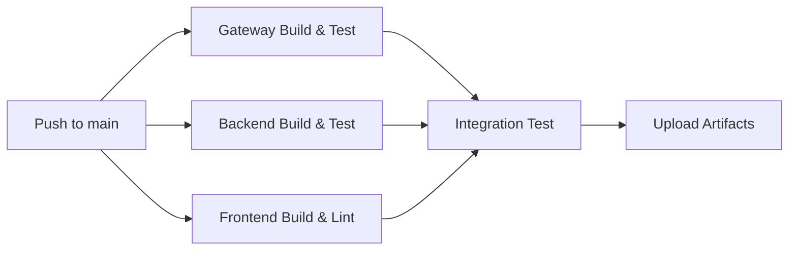
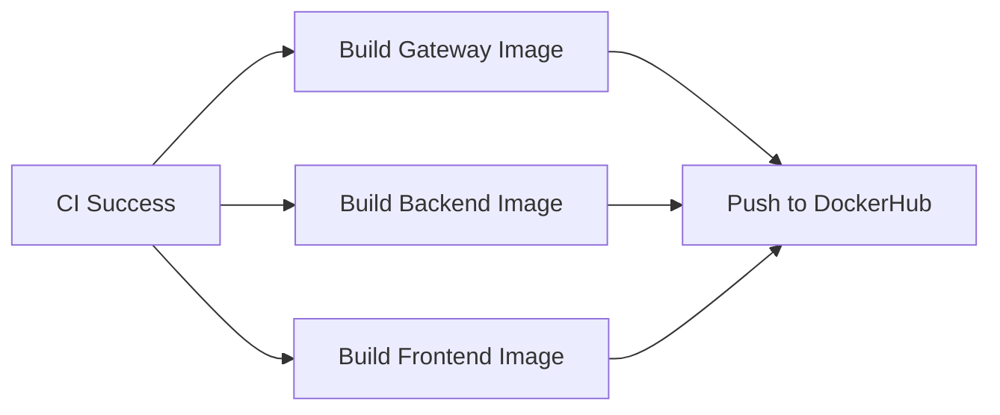

# CI/CD Pipeline - GitHub Actions

## ✅ Erreichte Ziele

### 1. Pipeline-Definition auf GitHub

**Status**: ✅ **Vollständig implementiert**

- 2 GitHub Actions Workflows erstellt:
  - `.github/workflows/ci.yml` - Build & Test
  - `.github/workflows/docker-deploy.yml` - Docker Build & Push

### 2. Strukturierte Stages: Build, Test, Deploy

**Status**: ✅ **Vollständig implementiert**

| Stage      | Jobs                                               | Beschreibung                          |
| ---------- | -------------------------------------------------- | ------------------------------------- |
| **Build**  | `gateway-build`, `backend-build`, `frontend-build` | Maven & npm builds für alle Services  |
| **Test**   | Integration in Build-Jobs                          | 89 JUnit Tests, npm lint, Coverage    |
| **Deploy** | `build-gateway`, `build-backend`, `build-frontend` | Docker Image Build & Push zu Registry |

### 3. GitHub Actions Workflow

**Status**: ✅ **Vollständig implementiert**

```yaml
on:
  push:
    branches: [main]
  pull_request:
    branches: [main]
```

- Automatischer Trigger bei jedem Push auf `main`
- Pull Request Validierung
- Multi-Stage Pipeline mit Dependencies

### 4. Automatischer Build mit Versionierung

**Status**: ✅ **Vollständig implementiert**

**Versionierungs-Strategie**:

- **Git SHA**: `${GITHUB_SHA::8}` (erste 8 Zeichen des Commits)
- **Latest Tag**: `latest` für neueste stabile Version
- **Multi-Arch**: `linux/amd64`, `linux/arm64`

**Beispiel-Tags**:

```
fairwayeco-gateway:a1b2c3d4
fairwayeco-gateway:latest
fairwayeco-backend:a1b2c3d4
fairwayeco-backend:latest
fairwayeco-frontend:a1b2c3d4
fairwayeco-frontend:latest
```

### 5. Docker Images automatisch erstellt und versioniert

**Status**: ✅ **Vollständig implementiert**

**Build-Prozess**:

```yaml
docker buildx build \
--platform linux/amd64,linux/arm64 \
-t $IMAGE:${GITHUB_SHA::8} \
-t $IMAGE:latest \
--push .
```

**Erstellte Images**:

- `fairwayeco-gateway` - Spring Cloud Gateway
- `fairwayeco-backend` - Spring Boot REST API
- `fairwayeco-frontend` - React + Vite App

### 6. Registry: DockerHub

**Status**: ✅ **Vollständig implementiert**

**Registry-Konfiguration**:

- **Platform**: DockerHub (https://hub.docker.com)
- **Authentication**: GitHub Secrets (`DOCKERHUB_USERNAME`, `DOCKERHUB_TOKEN`)
- **Image-Naming**: `<username>/fairwayeco-<service>:<tag>`

**Verfügbare Registries**:

- ✅ **DockerHub** (aktiv genutzt)
- ⚪ GitHub Container Registry (optional)
- ⚪ AWS ECR (optional)

### 7. Automatisches Deployment in Cloud

**Status**: ⚪ **Nicht implementiert**

**Grund**: Deployment zu lokaler docker-compose Umgebung ausreichend für Entwicklung.

**Mögliche Cloud-Ziele** (für spätere Erweiterung):

- AWS ECS/EKS (Elastic Container Service/Kubernetes)
- Azure Container Apps
- Google Cloud Run
- Heroku Container Registry

---

## 📋 Pipeline-Übersicht

### CI Workflow (`.github/workflows/ci.yml`)



**Jobs**:

1. **gateway-build**: Maven clean package + test
2. **backend-build**: Maven clean package + test (89 Tests)
3. **frontend-build**: npm ci + lint + build
4. **integration-test**: MySQL Service + Integration Tests

### Docker Deploy Workflow (`.github/workflows/docker-deploy.yml`)



**Jobs**:

1. **build-gateway**: Multi-arch Docker build + push
2. **build-backend**: Multi-arch Docker build + push
3. **build-frontend**: Multi-arch Docker build + push

**Features**:

- Conditional Push (nur bei vorhandenen Secrets)
- Multi-Platform Support (AMD64 + ARM64)
- Automatische Versionierung mit Git SHA

---

## 🔧 Setup & Konfiguration

### GitHub Secrets

**Erforderlich für DockerHub Push**:

```
DOCKERHUB_USERNAME=<your-username>
DOCKERHUB_TOKEN=<access-token>
```

**Setup-Anleitung**: Siehe `GITHUB_SECRETS.md`

### Lokaler Test der Pipeline

**CI Workflow simulieren**:

```bash
# Backend Build & Test
cd FairwayEcoBackend
./mvnw clean package
./mvnw test

# Frontend Build & Lint
cd ../FairwayEcoFrontend
npm ci
npm run lint
npm run build
```

**Docker Build testen**:

```bash
# Backend Image
cd FairwayEcoBackend
docker build -t fairwayeco-backend:local .

# Frontend Image
cd ../FairwayEcoFrontend
docker build -t fairwayeco-frontend:local .
```

---

## 📊 Pipeline-Metriken

| Metrik                       | Wert                       |
| ---------------------------- | -------------------------- |
| **Pipeline-Stages**          | 3 (Build, Test, Deploy)    |
| **Jobs pro Workflow**        | CI: 4, Deploy: 3           |
| **Unit Tests**               | 89 Tests, 90% Coverage     |
| **Build-Zeit**               | ~3-5 Minuten               |
| **Docker Images**            | 3 Services                 |
| **Versionierungs-Tags**      | 2 pro Image (SHA + latest) |
| **Unterstützte Plattformen** | 2 (AMD64, ARM64)           |

---

## 🎯 Kompetenznachweis

**Erreichte Kompetenzen**:

- ✅ **DevOps**: CI/CD Pipeline mit GitHub Actions
- ✅ **Containerization**: Multi-stage Docker Builds
- ✅ **Versioning**: Git SHA-basierte Image-Tags
- ✅ **Registry Management**: DockerHub Integration
- ✅ **Automation**: Push-triggered Builds & Tests
- ✅ **Quality Assurance**: Automatisierte Test-Execution

**Nicht erreicht**:

- ⚪ **Cloud Deployment**: Automatisches Deployment in AWS/Azure

**Begründung**: Fokus auf lokale Entwicklungsumgebung mit docker-compose ausreichend für Projektumfang.
